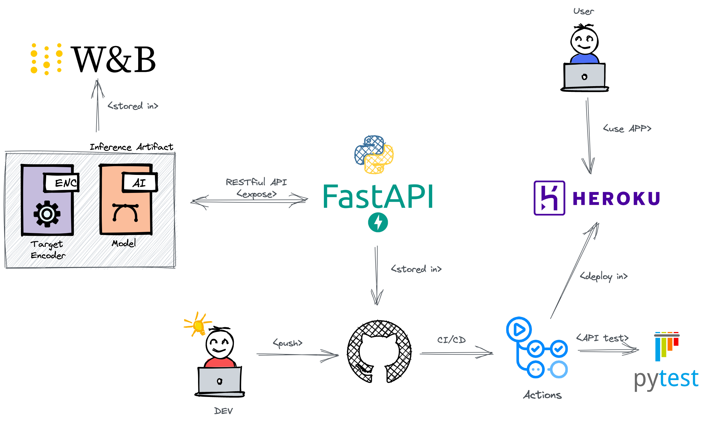
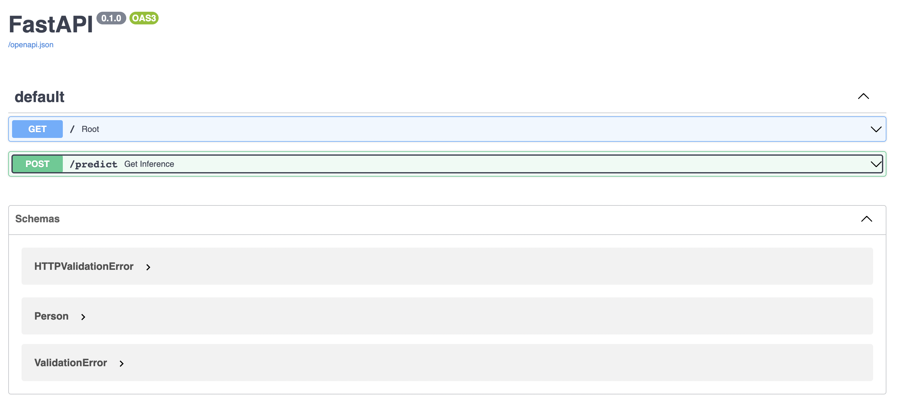
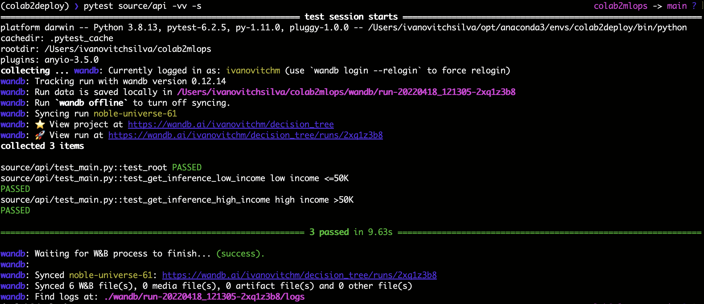

# Lesson Overview

In this lesson, we will apply the skills acquired in the [Machine Learning Fundamentals and Decision Trees](https://github.com/ivanovitchm/ppgeecmachinelearning/tree/main/lessons/week_02/sources) lesson to deploy a classification model on publicly available [Census Bureau data](http://archive.ics.uci.edu/ml/datasets/Adult). 

We will deploy the model using the [FastAPI](https://fastapi.tiangolo.com/) package and create API tests. The API tests will be incorporated into a CI/CD framework using GitHub Actions. After we build our API locally and test it, we will deploy it to [Heroku](https://www.heroku.com/) and test it again once live. [Weights & Biases](https://wandb.ai/) will be used to manage and tracking all artifacts.


<center></center>


## :arrow_forward: Environment Setup

Create a conda environment with ``environment.yml``:

```bash
conda env create --file environment.yml
```

To remove an environment in your terminal window run:

```bash
conda remove --name myenv --all
```

To list all available environments run:

```bash
conda env list
```

To activate the environment, use

```bash
conda activate myenv
```

## :rocket: Introduction to FastAPI

**FastAPI** is a modern API framework that relies heavily on type hints for its capabilities.

As the name suggests, FastAPI is designed to be fast in execution and also in development. It is built for maximum flexibility in that it is solely an API. You are not tied into particular backends, frontends, etc. Thus enabling composability with your favorite packages and/or existing infrastructure.

Getting started is as simple as writing a main.py containing:

```python
from fastapi import FastAPI

# Instantiate the app.
app = FastAPI()

# Define a GET on the specified endpoint.
@app.get("/")
async def say_hello():
    return {"greeting": "Hello World!"}
```

To run our app, we will use [uvicorn](https://www.uvicorn.org/) in our shell: ```uvicorn source.hello_world.main:app --reload```. 

> Uvicorn is an ASGI (Asynchronous Server Gateway Interface) web server implementation for Python. 

By default, our app will be available locally at ```http://127.0.0.1:8000```. The ```--reload``` allows you to make changes to your code and have them instantly deployed without restarting *uvicorn*. For further reading the [FastAPI docs](https://fastapi.tiangolo.com/) are excellently written, check them out!

### Core Features of FastAPI

FastAPI's ```type checking``` uses a mix of standard Python type hints in function definitions as well as the [package Pydantic](https://pydantic-docs.helpmanual.io/) to define data models which define the types that are expected in a request body, like the following example:

```python
# Import Union since our Item object will have tags that can be strings or a list.
from typing import Union 

from fastapi import FastAPI
# BaseModel from Pydantic is used to define data objects.
from pydantic import BaseModel

# Declare the data object with its components and their type.
class TaggedItem(BaseModel):
    name: str
    tags: Union[str, list] 
    item_id: int

app = FastAPI()

# This allows sending of data (our TaggedItem) via POST to the API.
@app.post("/items/")
async def create_item(item: TaggedItem):
    return item
```

This little bit of code unlocks many features such as converting the body to JSON, converting and validating types as necessary, and generating automatic documentation (which we can visit by going to 127.0.0.1:8000/docs or the equivalent URL when live). For run:

```bash
uvicorn source.hint.main:app --reload
```

### Path and Query Parameters

In the previous example we learned how to use [Pydantic](https://pydantic-docs.helpmanual.io/) to create a data model which we passed in as a request body. Now we will build on that and with **path** and **query** parameters:

```python
# A GET that in this case just returns the item_id we pass, 
# but a future iteration may link the item_id here to the one we defined in our TaggedItem.
@app.get("/items/{item_id}")
async def get_items(item_id: int, count: int = 1):
    return {"fetch": f"Fetched {count} of {item_id}"}

# Note, parameters not declared in the path are automatically query parameters.
```

**Path** and **query** parameters are naturally strings since they are part of the endpoint URL. However, the type hints automatically convert the variables to their specified type. FastAPI automatically understands the distinction between **path** and **query** parameters by parsing the declaration. Note, to create optional query parameters use ```Optional``` from the ```typing``` module.

If we wanted to query the above API running on our local machine it would be via ```http://127.0.0.1:8000/items/42/?count=1```. For run, type:

```bash
uvicorn source.query.main:app --reload
```

### Local API Testing

As we saw previous running FastAPI locally is straight forward: ```uvicorn source.query.main:app --reload```.

However, this is clunky, and likely impossible if we want to run our tests automatically in our Continuous Integration framework. To get around this FastAPI includes a built-in testing framework:

```python
from fastapi.testclient import TestClient

# Import our app from main.py.
from main import app

# Instantiate the testing client with our app.
client = TestClient(app)

# Write tests using the same syntax as with the requests module.
def test_api_locally_get_root():
    r = client.get("/")
    assert r.status_code == 200
```

Now, lets return to our example in ```query/main.py```. Stylistically, I split each test into separate functions. Some people will put all tests of a single function/method in a single test function, others will break it out. I find that the approach below facilitates rapid identification of what exactly is failing when a test breaks. Assuming the app is located in ```source/query/main.py``` then for ```source/local_testing/test_main.py``` I have:

```python
from fastapi.testclient import TestClient
from source.query.main import app

client = TestClient(app)

# a unit test that tests the status code and response of the defined path
def test_get_path():
    r = client.get("/items/42")
    assert r.status_code == 200
    assert r.json() == {"fetch": "Fetched 1 of 42"}

# a unit test that tests the status code and response of the defined query
def test_get_path_query():
    r = client.get("/items/42?count=5")
    assert r.status_code == 200
    assert r.json() == {"fetch": "Fetched 5 of 42"}

# a unit test that tests the status code
def test_get_malformed():
    r = client.get("/items")
    assert r.status_code != 200
```

For run:

```bash
pytest source/local_testing -vv -s
```


## :twisted_rightwards_arrows: API Deployment with FastAPI

[FastAPI](https://fastapi.tiangolo.com/) is a modern API framework that allows you to write code quickly without sacrificing flexibility or extensibility. FastAPI will be used in this project in order to conclude the CI/CD stages. After we build our API locally and test it, we will deploy it to [Heroku](https://www.heroku.com/) and test it again once live.

An important note, don't forget [Wandb](https://wandb.ai/), we need to login to it. In the terminal run:

```
wandb login <paste your api key here>
```

### API Creation

It was created and implemented a RESTful API using FastAPI containing the following features:

- Pydantic body with all columns and hints of an instance. 
- A ``schema extra`` describing an typical example of an instance according FastAPI [documentation](https://fastapi.tiangolo.com/tutorial/schema-extra-example/).
- GET on the root giving a welcome message.
- POST on the predict in order to proceed model inference. 
- Three unit test to test the API, one for the GET and two for POST (high income >50k and low income <=50k)

The API is implemented in the ``source/api/main.py`` whereas tests are on ``source/api/test_main.py``.

For the sake of understanding and during the development, the API was constanly tested using:

```bash
uvicorn source.api.main:app --reload
```

and using these addresses:

```bash
http://127.0.0.1:8000/
http://127.0.0.1:8000/docs
```

The screenshot below show a view of the API docs.

<center></center>

For test the API, please run:

```bash
pytest source/api -vv -s
```

<center></center>

## :gear: Introduction to CI/CD

There are nearly as many ```principles``` of software engineering as grains of sand on a beach. Many principles focus on the process of writing code (such as the Single Responsibility Principle that states that every module/class/function should serve a single purpose), but for our purposes here we will focus on principles that pertain to **model deployment**.

Specifically we will focus on **automation**, **testing**, and **versioning**. None of these are unique to deploying a model, but each one plays an important role as we will see in the following videos.

These principles leads us into **Continuous Integration** and **Continuous Delivery** (CI/CD). To put CI/CD into practice we will leverage [GitHub Actions](https://github.com/features/actions) and [Heroku](https://www.heroku.com/), respectively.

**Continuous Integration** and **Continuous Delivery** (or Deployment) (CI/CD) is a core driver of putting software engineering principles into practice.

Continuous integration is the practice of ensuring changes to the code fit into the overall code base. This is done by running our unit test suite and attempting to build the code on any platforms we choose to target. If this succeeds then the code is integrated. **A robust testing suite is the backbone of a reliable continuous integration procedure**.

If continous integration is the practice of making sure code is always deployable, then continuous delivery is the practice of keeping code actually deployed. CD allows you to make changes to the code, have it be verified by your CI process, and then immediately get served to your users without downtime.

### Continuous Integration with GitHub Actions

GitHub Actions is CI/CD **built right into GitHub** and comes with a plethora of pre-built workflows such as running your test suite or checking in if your code has any flake8 errors.

Setting up a GitHub Action is as straightforward as specifying when the action occurs, such as on push, what sort of VM it runs on, what programs and packages it installs, and then ultimately what commands get run. Here is a portion of the template workflow for Python that GitHub provides:

```yml
name: Python package # Name of the Action.

on: [push] # When this action runs.

jobs:
  build:

    runs-on: ubuntu-latest # Which OS this runs on, you can also build on Windows or MacOS.
    strategy:
      matrix:
        python-version: [3.6, 3.7, 3.8] # You can build against multiple Python versions.

    steps:
    - uses: actions/checkout@v2 # Calling a pre-built GitHub Action which allows your Action to access your repository.
    - name: Set up Python ${{ matrix.python-version }} # Name of an action that sets up Python.
      uses: actions/setup-python@v2 # A pre-built GitHub Action that sets up a Python environment.
      with:
        python-version: ${{ matrix.python-version }}
    - name: Install dependencies # The first step that isn't just calling another action.
      run: |
        python -m pip install --upgrade pip # Upgrade pip to the latest version.
        pip install pytest # Install pytest.
        if [ -f requirements.txt ]; then pip install -r requirements.txt; fi # If we have a requirements.txt, then install it.
    - name: Test with pytest # Final action which runs pytest. If any test fails, then this Action fails.
      run: |
        pytest
```

See the inline comments for details on the steps in this workflow.

Beyond CI/CD GitHub Actions can also automate actions such as greeting users when they submit their first pull request to your repository.

Other popular platforms for CI/CD include [CircleCI](https://circleci.com/), [TravisCI](https://www.travis-ci.com/), and [Jenkins](https://www.jenkins.io/).


## :atom_symbol: Introduction to Heroku

[Heroku](https://www.heroku.com/) is a **cloud Platform-as-a-Service** (PaaS) that supports a variety of languages and allows users to deploy apps. For our purposes, we will use Heroku to run a Python application that consists of an API for machine learning inference.

Heroku is built around the concept of lightweight containers called [dynos](https://devcenter.heroku.com/articles/dynos) that are easily scalable and adaptable to a variety of tasks. For our work, we will be using one web dyno to run our API.

The instructions for launching an app are contained in a ```Procfile``` file that resides in the highest level of your project directory. This file declares the dyno type and the associated command on each line, e.g.:

```bash
web: uvicorn source.api.main:app
```

This ```Procfile``` specifies a web dyno that runs the command ```uvicorn``` which is then running a web app cleverly called ```app``` that resides in ```source/api/main.py```.

One great benefit to Heroku is that its [free to start out](https://devcenter.heroku.com/articles/getting-started-with-python)!

### Continuous Deployment with Heroku

>Heroku makes it easy to do CD. 

It provides multiple different deployment options with the two most common being ```Git``` and ```Docker``` based deployments. **We will leverage the GitHub connection**.

You can connect an existing repository to Heroku either using the web GUI or the CLI and from there you can enable continuous delivery so that all changes to your code automatically get deployed to your Heroku app. Furthermore, you can specify that the CD only occurs when your continuous integration (e.g. your unit tests) succeeds. Doing this tightly couples our CI and CD processes which will help us avoid deploying a broken app.

When creating apps on Heroku, it's important to think of your ```slug``` and its limitations. 

> The slug is your app and all of its dependencies, and it has a size limit of 500 MB.

For light use cases all of your code, model, and even data could fit within that limit. However large models or frameworks (such as TensorFlow 2) can easily exceed the limit. Where possible, trim what is included in your slug using a .slugignore file, and in our case, we can leverage our remote [W&B storage](wandb.ai) to contain our model and data and access them in our app when we need them.
